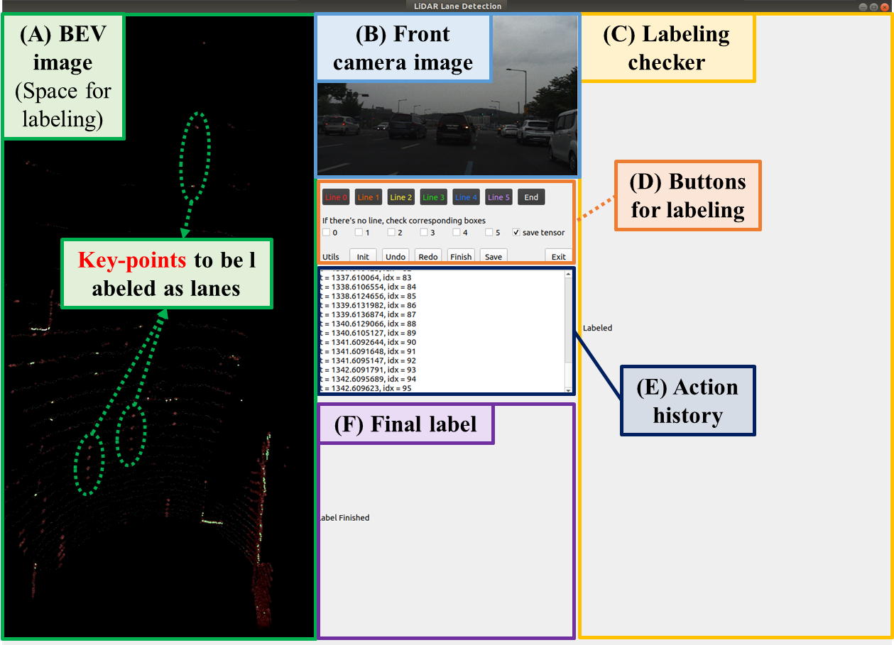
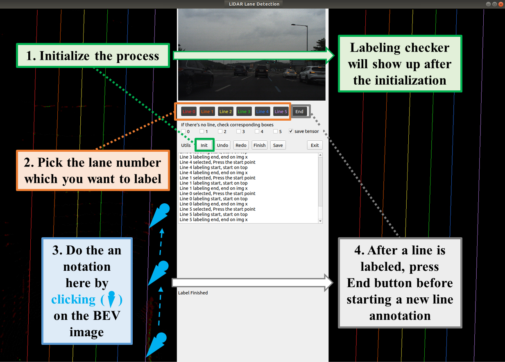
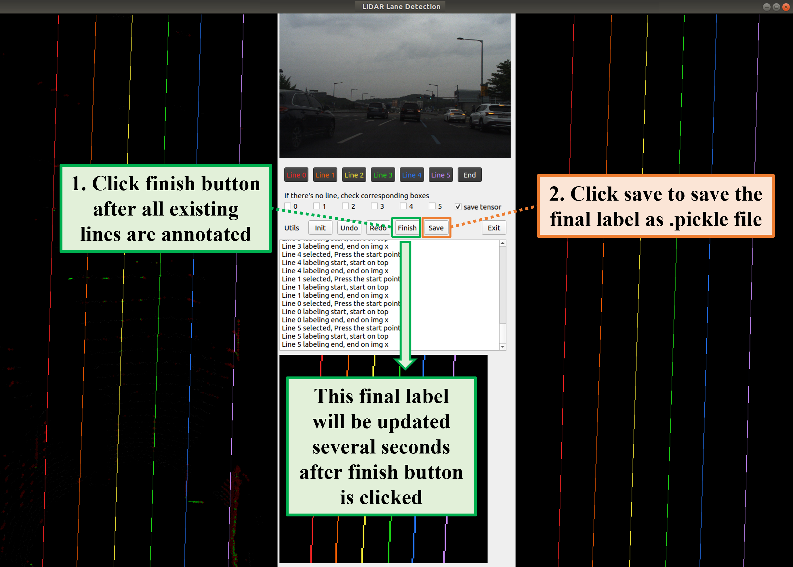

# K-Lane Annotation Tool

This is the documentation on how to use the annotation tool provided by K-Lane

# Requirements
1. Install ROS as directed by their site (we use ROS-Melodic)
2. Create a new conda environment
```
conda create -n #env-name python=3.7
```
3. Install the dependencies
```
pip install PyQt5 pyaml rospkg numpy tensorflow==1.15 opencv-python-headless
```
   * note: installing opencv-python with PyQt5 may result in xcb error

# Workspace Arrangement
```
KLaneDet
├── annot_tool
      ├── build
      ├── devel
      ├── frontal_image
      ├── point_cloud
      ├── src
          ├── gui_qt
                ├── temp
                      ├── seq_1
                            ├── bev_image
                            ├── bev_image_label
                            ├── bev_tensor
                            ├── bev_tensor_label
          ├── lidar_msgs
          ├── pc_pre_processor
          
├── baseline 
├── configs
├── data
├── logs
```

# Labelling a Point Cloud
Before starting the labelling process, make sure that:
   * A rosbag file containing recordings of both camera image and LiDAR point cloud is available
   * The `/frontal_image/`, `/point_cloud/`, `/src/gui_qt/temp/`, and their children directories have been created


1. Go to the `/annot_tool/` directory and setup the project by running
```
catkin_make
```
we need to run this line every time a change is introduced to the .cpp files

2. Source the project's setup.bash, run the roscore, and play your rosbag file
```
source devel/setup.bash
roscore
rosbag play #path_to_your_rosbag_file
```

3. Start the pointcloud preprocessor node
```
rosrun pc_pre_processor pc_pre_processor_node
```

4. Start the annotation tool GUI
```
python /src/gui_qt/mainframe.py
```

The initial GUI will look like the image below



5. Initialize the annotation tool and start annotating
   * Make sure to initialize first for every new point cloud frame
   * Tips: increasing the brightness of the display will help the annotation process significantly



7. Do the post-processing and save the annotation
   * The annotations and processed files can be found either on `/frontal_image/`, `/point_cloud/`, or `/src/gui_qt/temp/` under the sequence directory


